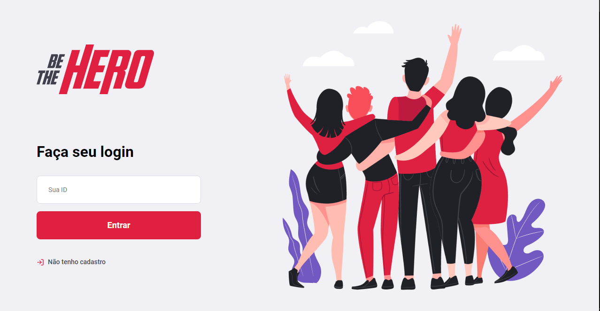

<h1 align="center">
    
</h1>

# 🚀 Semana OmniStack 11.0 
    
##  🚀  Technologies
This project was developed with the following technologies:
- [Node.js](https://nodejs.org/en/) 
- [Express](https://expressjs.com/pt-br/)
- [Sqlite3](https://www.sqlite.org/index.html)
- [Knex.js](http://knexjs.org/)
- [React](https://reactjs.org)
- [React Native](https://facebook.github.io/react-native/)
- [Expo](https://expo.io/)
- [Jest](https://jestjs.io/)
- [Celebrate](https://github.com/arb/celebrate)
- [Supertest](https://github.com/visionmedia/supertest)

## 💻 Project
Be The Hero is a project that aims to connect people who are willing to help ONGs.
## 🔖 Layout

<table>
    <tr>
        <td>  </td>
        <td>  </td>
        <td>  </td>
    </tr>
</table>
<table >
    <tr>
        <td>  </td>
        <td>  </td>
    </tr>
</table>

## 🤔 How to contribute
- Make a fork;
- Create a branck with your feature: `git checkout -b my-feature`;
- Commit changes: `git commit -m 'feat: My new feature'`;
- Make a push to your branch: `git push origin my-feature`.
After merging your receipt request to done, you can delete a branch from yours.
## 📝 License
This project is under the MIT license. See the [LICENSE](LICENSE.md) for details.
---
Made with ♥ by Kassiane Façanha  👋  [Get in touch!](https://www.linkedin.com/in/kassiane-fa%C3%A7anha-133727197/)